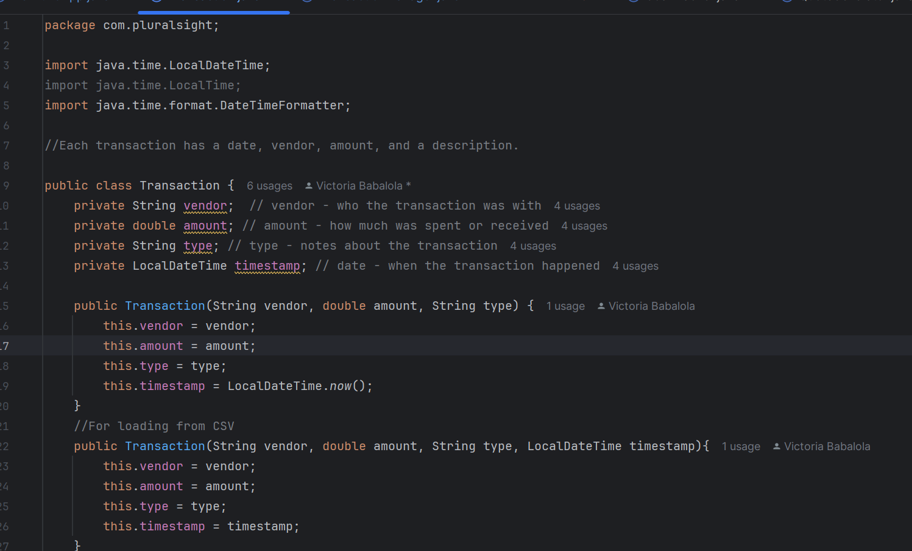

# 💸 FlexFund

**FlexFund** is a clean, confidence-building CLI app that helps you track your deposits, payments, savings goals, and available balance — with a little boss energy. 💅🏽

Forget boring spreadsheets. FlexFund is all about financial focus with flair.

---

## 🚀 Features

- ✨ **Motivational Quotes** at startup to hype you up
- 💰 **Add Deposits & Payments** to your transaction ledger
- 🧾 **View Ledger**: All transactions, deposits only, or payments only
- 📊 **View Available Balance** at any time
- 🎯 **Set Savings & Spending Goals**
- 🏆 **Achievement Alerts** when you hit your financial goals

---

## 🧠 What I Learned

- Java file handling with `Files.readAllLines()` and `Files.write()`
- Using conditionals and loops to navigate user input
- Organizing code into methods and helper classes
- Building user-friendly experiences in a CLI app
- 
|  |  |  |

